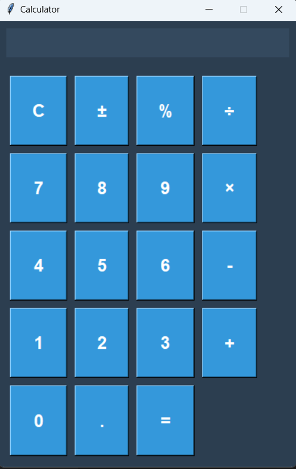

# 🧮 Modern Python Calculator

## 📌 Overview

A sleek, modern, and feature-rich calculator application built with Python and Tkinter, offering an intuitive user interface and advanced functionality.



## ✨ Features

### 🚀 Key Capabilities
- Modern, dark-themed UI
- Responsive design
- Keyboard and mouse input support
- Error handling
- Sign toggling
- Percentage calculations

### 🔢 Supported Operations
- Basic arithmetic (+, -, ×, ÷)
- Percentage calculations
- Sign toggling
- Clear and backspace functionality

## 🛠 Technology Stack


- **Language**: Python 3.8+
- **Framework**: Tkinter
- **UI Design**: Modern, responsive layout

## 🌟 Installation

### Prerequisites
- Python 3.8 or higher
- Tkinter (usually comes pre-installed)

### Setup Steps

1. Clone the repository
```bash
git clone https://github.com/rajnishdevelops/calculator.git
cd calculator